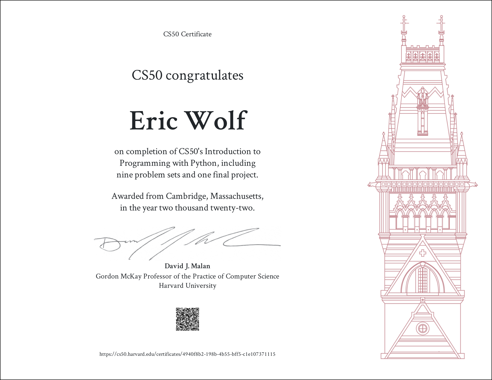

[<- Back to main](https://github.com/GrandEchoWhiskey)

<a href="https://cs50.harvard.edu/python/2022/">
   
</a>

<h1 align="center">CS50’s Introduction to Programming with Python</h1>

 

#### Free HarvardX course on [cs50.harvard.edu/python/2022][harvard_link] 
Certificate key: [8166d756-6d6c-415e-a048-72f658c432d3][certificate_link]

---

## Problem sets:
\# | Name | Description | Technology
:---: | :--- | :--- | :---:
0a | [Einstein][einstein_link] |  | [![Python][py_img]](#)
0b | [Faces][faces_link] |  | [![Python][py_img]](#)
0c | [Indoor][indoor_link] |  | [![Python][py_img]](#)
0d | [Playback][playback_link] |  | [![Python][py_img]](#)
0e | [Tip][tip_link] |  | [![Python][py_img]](#)
1a | [Bank][bank_link] |  | [![Python][py_img]](#)
1b | [Deep][deep_link] |  | [![Python][py_img]](#)
1c | [Extensions][extensions_link] |  | [![Python][py_img]](#)
1d | [Interpreter][interpreter_link] |  | [![Python][py_img]](#)
1e | [Meal][meal_link] |  | [![Python][py_img]](#)
2a | [Camel][camel_link] |  | [![Python][py_img]](#)
2b | [Coke][coke_link] |  | [![Python][py_img]](#)
2c | [Nutrition][nutrition_link] |  | [![Python][py_img]](#)
2d | [Plates][plates_link] |  | [![Python][py_img]](#)
2e | [Twttr][twttr_link] |  | [![Python][py_img]](#)
3a | [Fuel][fuel_link] |  | [![Python][py_img]](#)
3b | [Grocery][grocery_link] |  | [![Python][py_img]](#)
3c | [Outdated][outdated_link] |  | [![Python][py_img]](#)
3d | [Taqueria][taqueria_link] |  | [![Python][py_img]](#)
4a | [Adieu][adieu_link] |  | [![Python][py_img]](#)
4b | [Bitcoin][bitcoin_link] |  | [![Python][py_img]](#)
4c | [Emojize][emojize_link] |  | [![Python][py_img]](#)
4d | [Figlet][figlet_link] |  | [![Python][py_img]](#)
4e | [Game][game_link] |  | [![Python][py_img]](#)
4f | [Professor][professor_link] |  | [![Python][py_img]](#)
5a | [Test_bank][test_bank_link] |  | [![Python][py_img]](#)
5b | [Test_fuel][test_fuel_link] |  | [![Python][py_img]](#)
5c | [Test_plates][test_plates_link] |  | [![Python][py_img]](#)
5d | [Test_twttr][test_twttr_link] |  | [![Python][py_img]](#)
6a | [Lines][lines_link] |  | [![Python][py_img]](#)
6b | [Pizza][pizza_link] |  | [![Python][py_img]](#)
6c | [Scourgify][scourgify_link] |  | [![Python][py_img]](#)
6d | [Shirt][shirt_link] |  | [![Python][py_img]](#)
7a | [Numb3rs][numb3rs_link] |  | [![Python][py_img]](#)
7b | [Response][response_link] |  | [![Python][py_img]](#)
7c | [Um][um_link] |  | [![Python][py_img]](#)
7d | [Watch][watch_link] |  | [![Python][py_img]](#)
7e | [Working][working_link] |  | [![Python][py_img]](#)
8a | [Jar][jar_link] |  | [![Python][py_img]](#)
8b | [Seasons][seasons_link] |  | [![Python][py_img]](#)
8c | [Shirtificate][shirtificate_link] |  | [![Python][py_img]](#)
fp | [Sorting Algorythm Tester][fproj_link] |  | [![Python][py_img]](#)

  
---
  

<!-- Links -->

[harvard_link]:     https://cs50.harvard.edu/python/2022/
[certificate_link]: https://certificates.cs50.io/4940f8b2-198b-4b55-bff5-c1e107371115

[einstein_link]:            pset-0-einstein
[faces_link]:               pset-0-faces
[indoor_link]:              pset-0-indoor
[playback_link]:            pset-0-playback
[tip_link]:                 pset-0-tip
[bank_link]:                pset-1-bank
[deep_link]:                pset-1-deep
[extensions_link]:          pset-1-extensions
[interpreter_link]:         pset-1-interpreter
[meal_link]:                pset-1-meal
[camel_link]:               pset-2-camel
[coke_link]:                pset-2-coke
[nutrition_link]:           pset-2-nutrition
[plates_link]:              pset-2-plates
[twttr_link]:               pset-2-twttr
[fuel_link]:                pset-3-fuel
[grocery_link]:             pset-3-grocery
[outdated_link]:            pset-3-outdated
[taqueria_link]:            pset-3-taqueria
[adieu_link]:               pset-4-adieu
[bitcoin_link]:             pset-4-bitcoin
[emojize_link]:             pset-4-emojize
[figlet_link]:              pset-4-figlet
[game_link]:                pset-4-game
[professor_link]:           pset-4-professor
[test_bank_link]:           pset-5-test_bank
[test_fuel_link]:           pset-5-test_fuel
[test_plates_link]:         pset-5-test_plates
[test_twttr_link]:          pset-5-test_twttr
[lines_link]:               pset-6-lines
[pizza_link]:               pset-6-pizza
[scourgify_link]:           pset-6-scourgify
[shirt_link]:               pset-6-shirt
[numb3rs_link]:             pset-7-numb3rs
[response_link]:            pset-7-response
[um_link]:                  pset-7-um
[watch_link]:               pset-7-watch
[working_link]:             pset-7-working
[jar_link]:                 pset-8-jar
[seasons_link]:             pset-8-seasons
[shirtificate_link]:        pset-8-shirtificate

[fproj_link]:           https://github.com/GrandEchoWhiskey/cs50-fp-sorting_algorythm_tester

[py_img]: https://github.com/GrandEchoWhiskey/grandechowhiskey/blob/main/icons/programming/python.png
